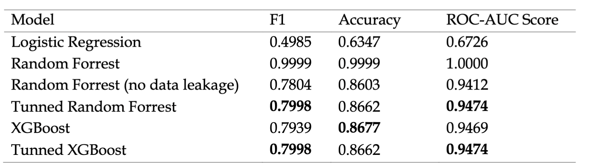

# Optimizing-Offer-Impact-in-the-Starbucks-Reward-Program-A-Machine-Learning-Approach
The capstone project for Udacity's machine learning engineer (MLE) nanodegree program.

## Project Overview

The influence of personalized marketing is undeniable in today's retail sector, significantly impacting customer retention and satisfaction. The Starbucks Rewards mobile app is one such avenue where personalized marketing is executed, providing offers to customers to enhance sales and customer loyalty. Historically, companies like Starbucks have employed various strategies to entice customer purchases, including the use of special offers and discounts (Smith, 2016). However, not all customers respond to all offers, necessitating a more targeted marketing approach. This project aims to explore this domain, leveraging data science and machine learning to predict customer behavior in response to offers, thereby optimizing the marketing strategy. 

The goal of my capstone project is to understand the customer behavior through machine learning models and decide which features of customer will respond to promotion offers that empowers a more targeted marketing approach to launch promotion plan.  

Multiple classification models are built and evaluated to predict the probability that the customer will complete the promotion offer. As a result, it will maximize the promotion campaign efficiency later in the future.  

## Installation

This project is written in Python 3 using Jupyter notebooks. The relevant Python packages include:
* numpy
* matplotlib
* scikit-learn
* pandas
* seaborn
* json
* math
* imblearn
* xgboost
* shap

## Model result:

## Summary Project Goal, Approach & Conclusion:
The project aimed to understand customer behavior in response to promotional offers using machine learning models. The objective was to identify which features of customers are most likely to respond to promotions, enabling a more targeted marketing strategy.

* Data and Methodology:
Data from the Starbucks mobile app was used, encompassing customer demographics, offer details, and transaction records. The data cleaning and preprocessing phase involved handling missing values, addressing inconsistencies, and transforming categorical variables. Feature engineering was applied to combine datasets into a unified framework for modeling.

* Model Development:
Several models were tested, starting with Logistic Regression as a baseline, progressing to ensemble methods like Random Forests and XGBoost, and employing hyperparameter tuning to optimize their performance. AWS SageMaker Studio was the chosen platform for development due to its computational efficiency and scalability.

* Evaluation Metrics:
The models were evaluated using F1-score, accuracy, and AUC-ROC score. F1-score was the primary metric due to its relevance in imbalanced class scenarios, balancing precision and recall. Accuracy and AUC-ROC provided additional performance insights.

* Results:
The initial Random Forest model showed perfect scores, which indicated data leakage. After correcting this, the performance metrics were more realistic and still strong, with the no data leakage Random Forest model showing an F1 score of 0.7804, accuracy of 0.8603, and ROC-AUC score of 0.9412. Hyperparameter tuning further improved the performance slightly for both Random Forest and XGBoost models.

* Conclusion:
The project successfully demonstrated the use of machine learning to predict customer response to promotional offers. The tuned Random Forest and XGBoost models emerged as the most promising, showing potential for deployment in a real-world scenario. Logistic Regression was found to be less effective for this particular dataset. The importance of avoiding data leakage was highlighted, as it could lead to overestimation of a model's performance.

The project's outcome provides a solid foundation for Starbucks to implement a data-driven marketing strategy, where promotional offers are tailored based on predictive insights, potentially leading to increased efficiency in marketing resource allocation and enhanced customer satisfaction.
